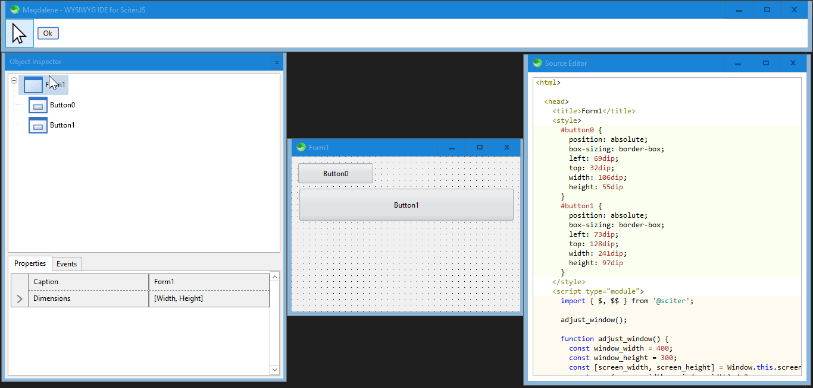

# WYSIWYG IDE for Sciter.JS

Inspired by [Lazarus](https://www.lazarus-ide.org/).

## Usage

Run [scapp.exe](https://github.com/c-smile/sciter-js-sdk/blob/main/bin/windows/x64/scapp.exe) inside this folder.

## Preview

:construction: Under construction. :construction:

